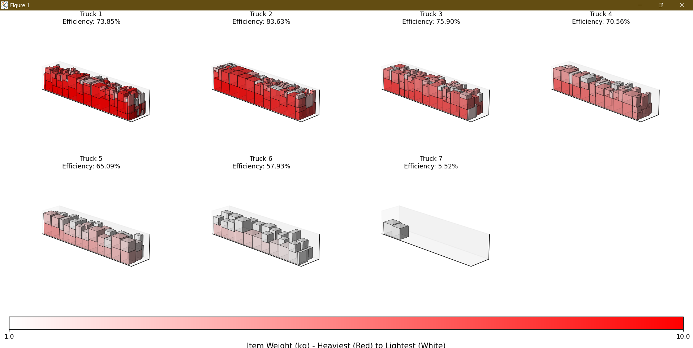
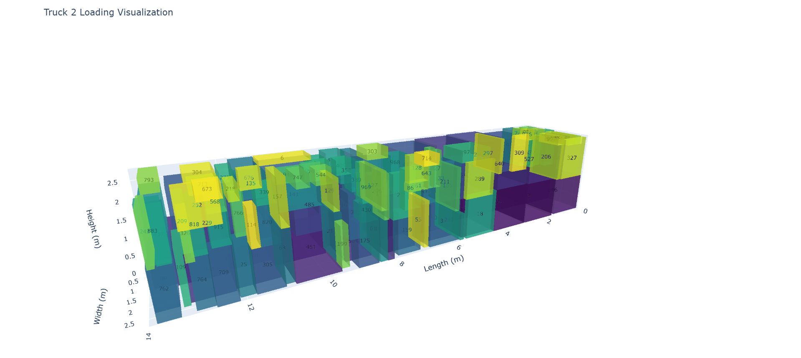

# Warehouse Reallocation

## Warehouse Relocation Project: 3D Bin Packing and Visualization

This project implements a 3D bin-packing algorithm to optimize the placement of items in trucks for warehouse relocation. It includes visualization tools to inspect the packing results interactively and in summary form.

## File Structure

```plaintext

WAREHOUSERELOCATION/
├── warehouse-reallocation/
│ |-- data_99_items.json # Sample dataset (99 items)
│ |-- data_999_items.json # Main dataset (999 items)
│ |-- output.json # Generated packing plan
| |-- main.py # Core packing algorithm
| |-- mainViz.py # Interactive 3D visualization (Plotly)
| |-- summaryViz.py # Summary visualization (Matplotlib)
| |-- README.md # This file
```

## Prerequisites

- **Python 3.8+**
- Required libraries:
  ```bash
  pip install plotly matplotlib numpy
  ```

## Usage

### Step 1: Run the Packing Algorithm

- Execute the main script (main.py) to generate the packing plan (`output.json`):
- Notes:

  - To change the input data file, go to **line 24** in `main.py` and give the relative path of the input file.
  - The algorithm uses truck dimensions of 14m (length) × 2.8m (width) × 2.8m (height).
  - Items are sorted by weight (descending) and volume (descending) for placement priority.

  - Outputs:
    - output.json: Contains item positions and assigned trucks.
    - Console log: Total trucks used and placement errors.

### Step 2: Visualize Results

- Run(summaryViz.py) for Summary visualization
- Features:

  - Grid of 3D truck plots.
  - Packing efficiency percentages.
  - Color gradient (red = heavy, white = light items).

  

- Run(mainViz.py) for Interactive 3D Visualization (Plotly)
- Features:

  - Interactive 3D plots for each truck.
  - Hover to see item IDs and weights.
  - Rotate/zoom to inspect placements.
  - Labels show item IDs at cube centers.

  

## Output Details

- output.json Structure

```plaintext
[
{
"Count_ID": "Item123",
"TruckNumber": 1,
"x": 0.0, // X-coordinate (meters)
"y": 0.0, // Y-coordinate
"z": 0.0, // Z-coordinate (height)
"weight": 50.2, // Item weight (kg)
"length": 1.2, // Item dimensions
"width": 0.8,
"height": 1.0,
"volume": 0.96 // Cubic meters
},
...
]
```

## Key Constraints

- Weight Capacity: Each truck supports up to 10,000 kg.
- Stacking Rules:
  - Items must have ≥70% area supported by lower items.
  - Fragile items have reduced weight-bearing capacity.
  - Rotation: All 6 possible item orientations are considered.

## Troubleshooting

- ModuleNotFoundError: Install missing dependencies:
  ``pip install plotly matplotlib numpy`
- File Path Issues: Run scripts from the root directory `(warehouse-reallocation/)`.
- To change the input data file, go to **line 24** in `main.py` and give the relative path of the input file.
- Run `main.py` before running `mainViz.py` and `summaryViz.py`.
- Dataset Testing: Use `data_99_items.json` in main.py for quicker results.
- This program only accepts JSON file as inputs. Please make sure your input file is of this type.
- Visualization Rendering:
  - Plotly: Requires browser support.
  - Matplotlib: Install a backend (e.g., `pip install pyqt5`).

## Algorithm Overview

- Item Loading: Convert JSON data into Item objects with calculated fragility and weight-bearing capacity.
- Space Management: Track available truck spaces using Cuboid objects.
- Packing Logic:

  - Prioritize heavier/larger items.
  - Check valid rotations and stacking constraints.
  - Split remaining space dynamically after placement.
  - Output Generation: Write item positions and metadata to output.json.
  - Flowchart

    

## Future Scope

| Sr. No. | Future Scope                            | Comments                                                                                                                                                                                                                                                            |
| ------- | --------------------------------------- | ------------------------------------------------------------------------------------------------------------------------------------------------------------------------------------------------------------------------------------------------------------------- |
| 1       | Create a UI for practical application   | Kivy python package                                                                                                                                                                                                                                                 |
| 2       | Distribute weights evenly in the trucks | The current process packs the items in such a way that the total weight of packed trucks decreases gradually from the first truck to the last. This does not break any of the constraints provided but in the real world, the weights should be distributed evenly. |
| 3       | Handle multiple file formats            | The process can be further enhanced to work with different file formats apart from JSON (like CSV/XLSX).                                                                                                                                                            |
| 4       | Error Handling                          | Real-time error messages instead of crashing.                                                                                                                                                                                                                       |
| 5       | Augmented Reality                       | To guide users in real-time using the phone camera.                                                                                                                                                                                                                 |
| 6       | Save Outputs in multiple file formats   | Provide PDF, CSV, or Excel reports summarizing the packing plan.                                                                                                                                                                                                    |
